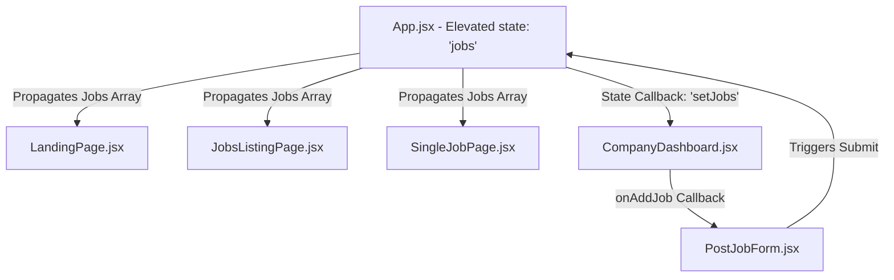

# 🌊 HireWave — Premium SaaS Job Matching Portal

HireWave is an ultra-premium, world-class SaaS job matching engine designed for modern web developers, recruiters, and engineering candidates. Inspired by top-tier interfaces like **Linear, Stripe, Vercel, Framer, and Wellfound**, HireWave combines a bright, elegant aesthetic with dynamic glassmorphism, responsive micro-animations, and high-fidelity React state-driven components.

---

## ⚡ Tech Stack & Architecture

HireWave is built using a modern, lightweight, and high-performance stack:

* **Core Framework:** React.js (v18+) & Vite (fast HMR and premium compilation speeds)
* **Styling Engine:** Tailwind CSS (v4+) for utility structures and layout responsiveness
* **Animations:** Framer Motion (v11+) for smooth UI transitions, layout transformations, and elegant float effects
* **Iconography:** Lucide React Icons for a clean, minimalist, and vector-perfect layout
* **Test Runner:** Vitest & React Testing Library (providing mock DOM and full lifecycle assertions)

---

## 🎨 Visual Design System & Aesthetics

The application layout uses a bright, premium startup theme incorporating curated visual tokens:

1. **Ambient Background Layers:** Multi-layered radial glowing gradients (`blue` ➔ `purple` ➔ `cyan`) that float silently behind components.
2. **Glassmorphism:** Custom `.glass-card` and `.glass-nav` utilities featuring high backdrop blur (`20px`), subtle border overlays, and soft drop-shadow depth maps.
3. **Typography:** Styled with modern geometric typography using rich font-weight hierarchies and custom color gradients.
4. **Micro-Animations:** Interactive elements feature custom hover scale-ups, subtle magnetic shifts, and card-elevation glows.

---

## 📂 Codebase Directory Map

```text
HireWave/
├── public/                 # Static visual assets
├── src/
│   ├── components/         # High-fidelity layout building blocks
│   │   ├── FAQItem.jsx         # Collapsible accordion drawers
│   │   ├── FilterSidebar.jsx   # Interactive desktop & mobile search filters
│   │   ├── Footer.jsx          # Professional multi-column footer navigation
│   │   ├── JobCard.jsx         # Glass card layout for individual requisitions
│   │   ├── Navbar.jsx          # Sticky glassmorphic header with active-link indicators
│   │   ├── OTPVerification.jsx # Keystroke-advancing digit verification inputs
│   │   └── PostJobForm.jsx     # Recruiter vacancy posting form (controlled state)
│   │
│   ├── data/               # Unified datastores
│   │   └── dummyData.js        # Seed datasets for jobs, reviews, and companies
│   │
│   ├── pages/              # Primary routing views
│   │   ├── AuthPage.jsx        # Login, signup, reset password, and verification screens
│   │   ├── CompaniesPage.jsx   # Premium directory of workspace partners
│   │   ├── CompanyDashboard.jsx# Recruiter dashboard (postings, talent pool, analytics)
│   │   ├── JobsListingPage.jsx # Core job engine, sidebar filters, & query search
│   │   ├── LandingPage.jsx     # Landing page (hero, testimonials carousel, FAQ)
│   │   ├── SingleJobPage.jsx   # Job detail view with apply telemetry & similarities
│   │   └── UserDashboard.jsx   # Candidate profile, saved listings, and application stages
│   │
│   ├── utils/              # Transition and animation setups
│   │   └── animations.js       # Framer Motion configuration presets
│   │
│   ├── App.jsx             # Shell & main state engine
│   ├── App.test.jsx        # Comprehensive 12-scenario integration test suite
│   ├── index.css           # Global custom scrollbars & glassmorphism configurations
│   ├── main.jsx            # DOM renderer entry point
│   └── setupTests.js       # Vitest DOM matching config
├── package.json            # Build pipeline scripts & dependencies
└── vite.config.js          # Hot reloading & Vite configurations
```

---

## 🔄 Parent State Elevation & Dynamic Job Postings

To solve mutation lag and allow immediate synchronization across the entire platform, HireWave implements **Parent State Elevation**:



### The Mechanism

1. **Single Source of Truth (`App.jsx`):**
   The application state is defined at the shell level:
   ```javascript
   const [jobs, setJobs] = useState(dummyJobs);
   ```
2. **Controlled Recruiter Form Inputs (`PostJobForm.jsx`):**
   Form inputs bind directly to a local React state object, ensuring visual synchronization:
   ```javascript
   const [formData, setFormData] = useState({
     title: '',
     location: '',
     salary: '',
     type: 'Full-time',
     description: ''
   });
   ```
3. **State Callback Trigger (`CompanyDashboard.jsx`):**
   Upon publication, a dynamic `newJob` object is constructed, pre-assigned with the recruiter’s authenticated company session:
   ```javascript
   const handleAddJob = (newJobData) => {
     const newJob = {
       id: jobs.length + 1,
       title: newJobData.title,
       company: user.name,
       logo: '💼',
       location: newJobData.location,
       salary: newJobData.salary,
       type: newJobData.type,
       level: 'Senior',
       description: newJobData.description,
       skills: ['React', 'TypeScript', 'Node.js'],
       applicants: 0,
       posted: 'Just now',
       featured: true,
       category: 'Frontend'
     };
     setJobs([newJob, ...jobs]);
   };
   ```
   This immediately prepends the requisition. Any navigation back to the Landing Page or Job Listings instantly displays the newly posted card!

---

## ⚡ Animations & CSS Utility Presets

### Global Scrollbars & Custom Glass Classes (`index.css`)
```css
/* Glassmorphism custom support utility classes */
.glass-card {
  background: rgba(255, 255, 255, 0.7);
  backdrop-filter: blur(20px);
  -webkit-backdrop-filter: blur(20px);
  border: 1px solid rgba(255, 255, 255, 0.4);
  box-shadow: 0 8px 32px 0 rgba(31, 38, 135, 0.04);
}

.glass-nav {
  background: rgba(255, 255, 255, 0.65);
  backdrop-filter: blur(24px);
  -webkit-backdrop-filter: blur(24px);
  border-bottom: 1px solid rgba(255, 255, 255, 0.3);
}
```

### Framer Motion Presets (`src/utils/animations.js`)
We use standardized micro-interaction presets to maintain visual fluidity:
* **`fadeInUp`**: Animates items slightly from below (`y: 15`) to their exact position (`y: 0`) while fading in opacity.
* **`buttonHover`**: Standardizes interactive scaling maps, slightly snapping down on tap (`whileTap: { scale: 0.98 }`) and expanding on hover.
* **`glowHover`**: Adds premium backdrop drop-shadow elevations to glass cards.

---

## 🧪 Testing & Validation Setup

HireWave includes a highly comprehensive automated integration test suite located at `src/App.test.jsx` built on top of Vitest. It validates **12 key user scenarios**:

| Test ID | Scenario | Target Behavior Checked |
|:---|:---|:---|
| **`T1`** | App Launch & Default Landing Page | Assures default landing renders with premium Hero banners and action hooks. |
| **`T2`** | Navbar Menu Navigation | Simulates clicking on Navbar items and checks page transitions. |
| **`T3`** | Landing Page CTA Redirect | Checks if primary "Explore Jobs" links trigger search pathways. |
| **`T4`** | Testimonial Slider Mechanics | Validates interactive carousel dot triggers and visual indicators. |
| **`T5`** | Job Keyword Filter | Filters through listings dynamically based on real-time keystroke queries. |
| **`T6`** | Job Bookmark Toggles | Assures candidate bookmarks successfully trigger save telemetry callbacks. |
| **`T7`** | Candidate Apply Telemetry | Assures the candidate portal registers clicks on "Apply Now". |
| **`T8`** | Job Post Alert Trigger | Checks validation fallback alerts in the recruiter vacancy popup. |
| **`T9`** | Session Authentication | Validates recruiter and candidate credentials and updates sessions. |
| **`T10`** | Security OTP Autofocus | Assures multi-factor code boxes capture digits and advance focus. |
| **`T11`** | Companies Page Navigation | Validates navigation to the new workplaces directory page and lists cards. |
| **`T12`** | Dynamic Posting State Mutation | Verifies form submissions in the Recruiter Dashboard update the state. |

---

## 🚀 Running the Project Locally

### 1. Install Dependencies
```bash
npm install
```

### 2. Launch the Development Server
Runs the project on Vite's ultra-fast local server:
```bash
npm run dev
```
Open `http://localhost:5173/` in your web browser.

### 3. Run the Test Suite
Executes all 12 automated integration tests:
```bash
npm run test
```

### 4. Build for Production
Compiles optimized production-ready HTML, JS, and CSS files:
```bash
npm run build
```
Preview the compiled build:
```bash
npm run preview
```

---

*Designed with ❤️ to feel extremely premium, responsive, and beautiful.*
